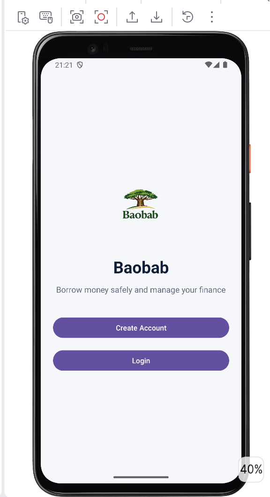
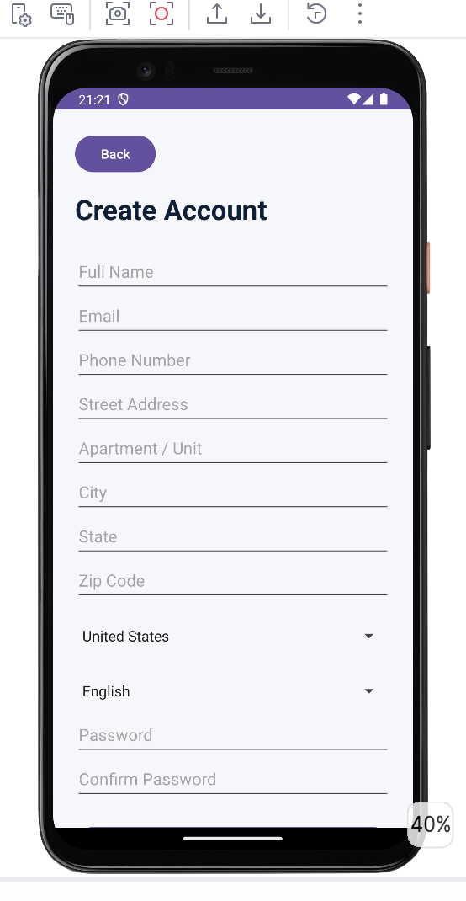
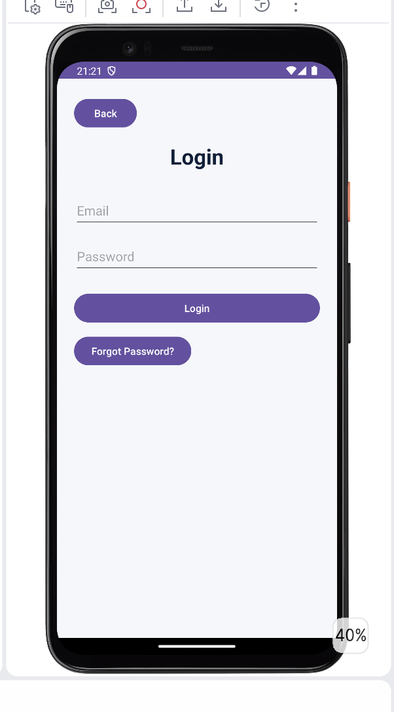
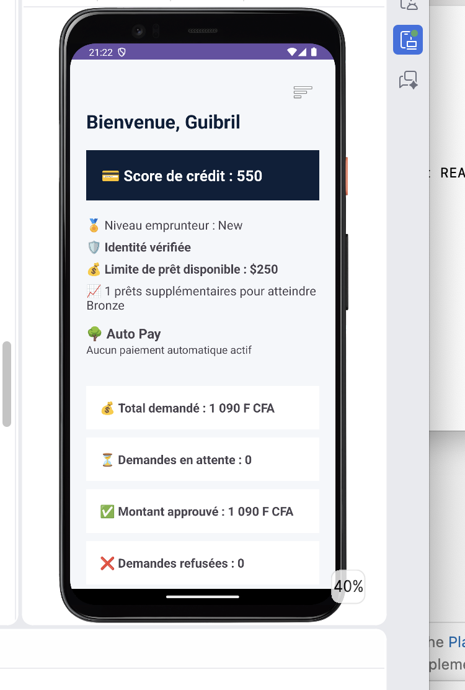
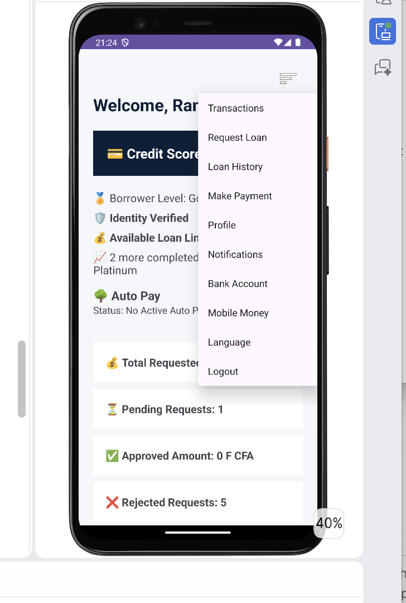
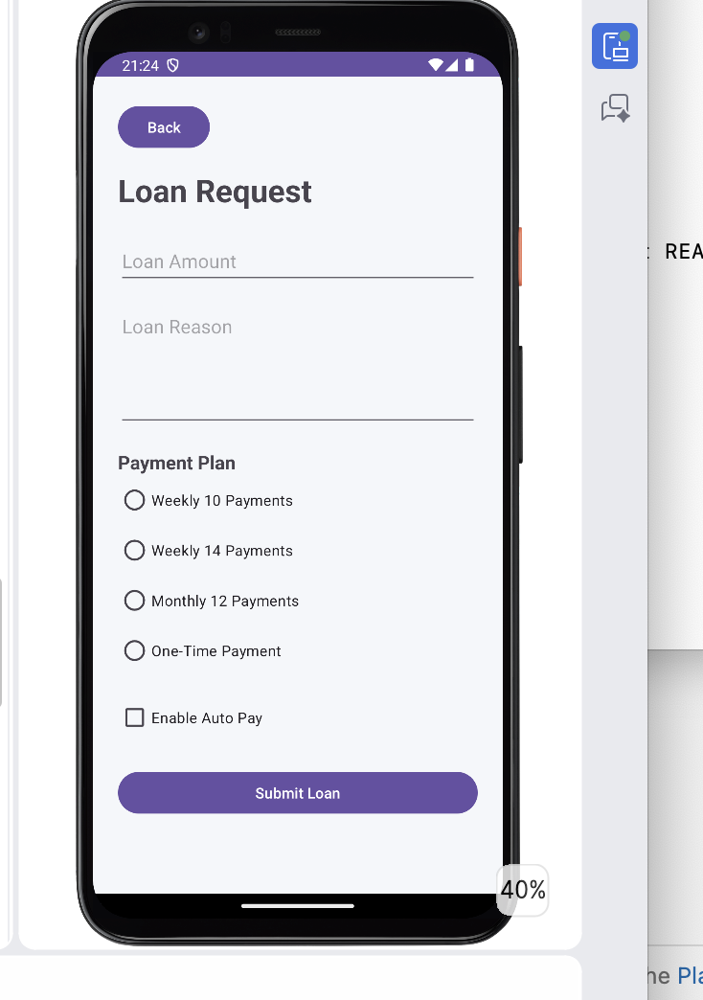
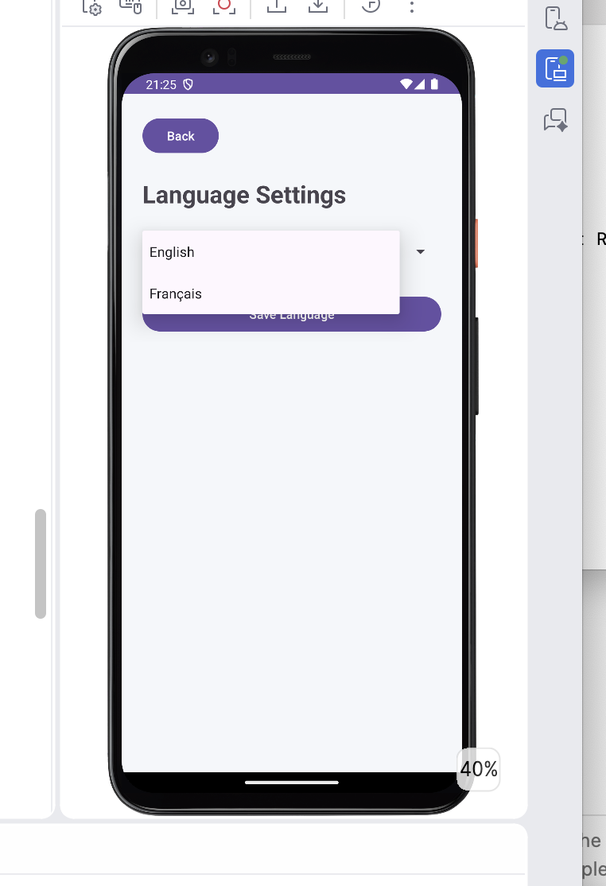
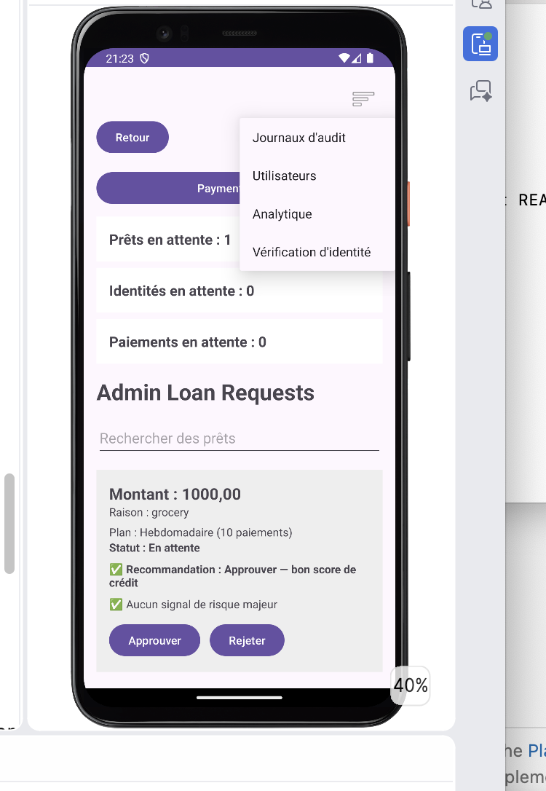
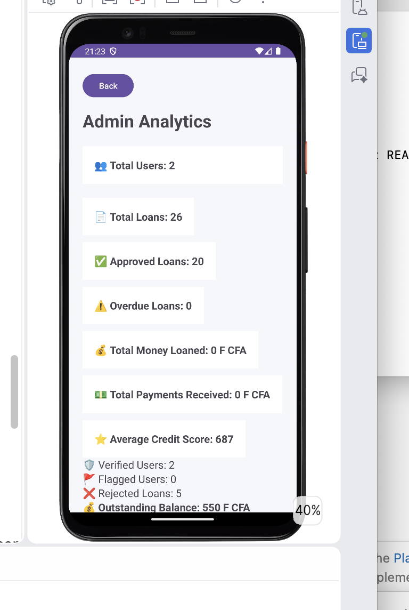

# Baobab Finance 🌳💰

Baobab Finance is a mobile lending platform built for individuals and small businesses seeking a simple and secure way to request, manage, and repay loans.

The application provides borrower onboarding, identity verification, loan request processing, agreement acceptance, payment tracking, and administrative management tools through a modern Android application built with Kotlin and Firebase.

## Version

**Current Release:** v1.0 Beta
**Release Date:** June 2026

---

## Features

### User Features

* User Registration and Authentication
* Email Login and Secure Password Management
* Identity Verification
* Phone Number Verification
* Loan Application Submission
* Loan Agreement Review and Acceptance
* Loan Status Tracking
* Payment Submission Workflow
* Borrower Level Progression System
* English and French Language Support

### Administrative Features

* Loan Approval and Rejection
* Payment Review and Approval
* Identity Verification Review
* Risk Flag Management
* User Management
* Audit Logging
* Analytics Dashboard

### Analytics

* Total Users
* Pending Loans
* Active Loans
* Approval Rate
* Average Loan Amount
* Total Repaid Amount

---

## Technology Stack

### Mobile Application

* Kotlin
* Android Studio
* XML Layouts
* RecyclerView

### Backend Services

* Firebase Authentication
* Cloud Firestore
* Firebase Storage
* Firebase Cloud Functions

### Notifications

* SendGrid Email Integration

### Security

* Role-Based Access Control
* Firestore Security Rules
* Firebase Storage Rules
* Identity Verification Workflow

---

## Application Architecture

Baobab Finance follows a client-server architecture using Firebase services.

Android Application
↓
Firebase Authentication
↓
Cloud Firestore Database
↓
Firebase Storage
↓
Cloud Functions
↓
Email Notifications

---

## Loan Workflow

1. User creates an account.
2. User verifies identity and phone number.
3. User submits a loan request.
4. Administrator reviews the request.
5. Loan agreement is presented.
6. User accepts agreement.
7. Loan becomes active.
8. User submits repayment.
9. Administrator reviews repayment.
10. Loan balance is updated.

---

## Screenshots

## SignUp

### Login Screen

### Dashboard

### Loan Request Screen

### Languages

### Admin Dashboard

### Analytics Dashboard

---

## Security

The application uses Firebase Authentication and Firestore Security Rules to ensure users can only access their own information while administrators maintain platform oversight.

Sensitive lending operations are protected through role-based authorization and verification workflows.

---

## Future Roadmap

### Planned Features

* Auto-Pay Support
* Push Notifications
* Enhanced Credit Scoring
* Banking Integrations
* Google Play Release
* Expanded Reporting Dashboard

---

## Author

Guibril Ramde

GitHub: japhet125

---

## Disclaimer

Baobab Finance is currently in beta testing and is intended for demonstration, educational, and evaluation purposes.
